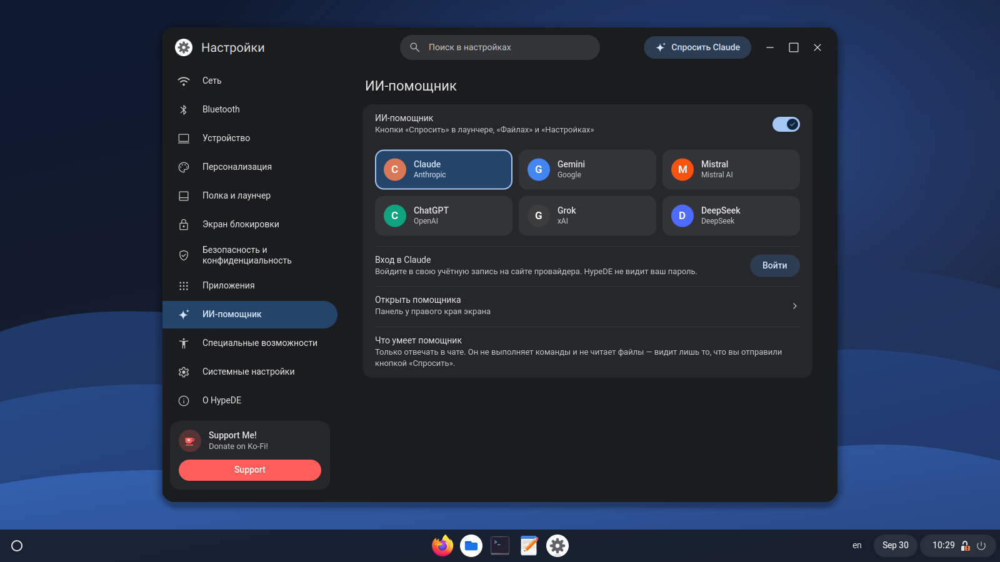

<p align="center">
  
</p>

<p align="center">
  A Chrome OS–style desktop built on GNOME Shell.<br>
  <a href="README.ru.md">Русский</a> · <a href="https://hypede.github.io">Website</a> · <a href="https://hypede.github.io/wiki/">Wiki</a>
</p>

<p align="center">
  
</p>

HypeDE is a separate session installed next to regular GNOME. No GNOME
package is modified: your login screen gets a “HypeDE” entry, and the normal
GNOME session keeps working as before.

## What's included

- **Shelf** at the bottom, side or top: pinned and running apps, the
  launcher, date, time and status area. It can float, hide under windows,
  and change size and opacity.
- **Launcher**, compact next to the shelf or full screen. Searches apps,
  settings, files in your home folder and the web, and does arithmetic.
- **Quick settings** as round buttons in three columns, like Chrome OS.
- **Lock screen** with a large clock, battery and load cards and a wave
  animation. Works without GDM too: SDDM, greetd and LightDM.
- **Settings** in Qt/QML. Network, Bluetooth, sound, printers and users are
  KDE modules shown inside the window; displays, mouse, keyboard,
  appearance, shelf, lock screen and services are HypeDE's own pages.
- **Files** in GTK 4: sidebar and path bar like GNOME Files, tabs and a
  details pane like COSMIC Files.
- **AI assistant** (optional): a side panel with Claude, Gemini, Mistral,
  ChatGPT, Grok or DeepSeek. You sign in with your own account on the
  provider's website; no API keys. “Ask” buttons live in the launcher,
  Files and Settings. The assistant cannot run commands.
- Its own icon theme (Material Symbols), sounds, wallpapers and a greeting
  at sign-in.

## Screenshots

<p align="center">
  
  
  
  
  
  
</p>

## Install on Arch Linux and CachyOS

```bash
git clone https://github.com/hypede/hypede
cd hypede/packaging
makepkg -si
```

Log out and pick the HypeDE session on the login screen.

KDE modules for Settings are optional. When one is missing, its row in
Settings names the package to install:

```bash
sudo pacman -S plasma-nm bluedevil plasma-pa print-manager plasma-workspace \
               plasma-desktop kde-cli-tools flatpak-kcm kinfocenter power-profiles-daemon
```

The AI assistant needs `webkitgtk-6.0`; GTK-style title bars for Qt apps
need `qadwaitadecorations-qt6` (AUR).

## Keys

| Shortcut | Action |
|---|---|
| Super | launcher |
| Super+S | overview |
| Super+L | lock the screen |
| Super+1…9 | open the n-th app on the shelf |
| Super+Space | next keyboard layout |

## How it works

HypeDE keeps its own settings database (`~/.config/dconf/hypede`), so
wallpaper, theme and shelf never mix with regular GNOME. On first sign-in it
copies keyboard layouts, mouse, touchpad, accessibility and shortcuts.

Extensions enabled for regular GNOME are not loaded unless you allow them in
Settings. The session starts only the GNOME services it needs; the file
indexer, GNOME Software and others can be enabled in Settings.

Without GDM, HypeDE creates GNOME's lock screen itself and checks the
password through PAM (`/usr/lib/hypede/hypede-auth`, service
`/etc/pam.d/hypede`).

```
shell/extension/   shell: shelf, launcher, quick settings, lock screen
session/           session startup, systemd units, password check
apps/settings/     Settings (C++, QML, KCMUtils)
apps/files/        Files (Python, GTK 4)
apps/assistant/    AI assistant (Python, WebKitGTK)
data/              schemas, icons, sounds, wallpapers
tools/             generators for themes, icons, sounds and screenshots
```

## Limitations

- KDE modules that configure KWin, KScreen or PowerDevil do nothing under
  GNOME, so displays, mouse, keyboard and power have HypeDE pages instead.
- Arranging several monitors still opens `gnome-control-center display`.
- Tested on GNOME Shell 50.5 with KDE Frameworks 6.30.

## Support

[Ko-fi](https://ko-fi.com/pycodder)

## License

[GPL-3.0-or-later](LICENSE). Material Symbols icons are Apache 2.0
(`data/icons/HypeDE/LICENSE`). The KDE colour schemes in
`apps/settings/colors/` are based on Breeze.
