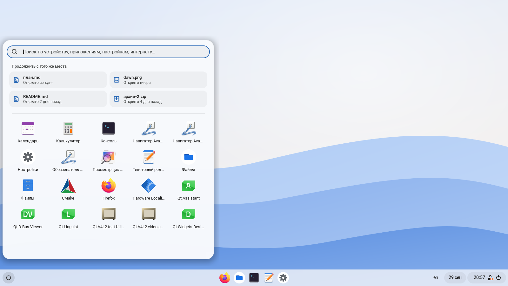
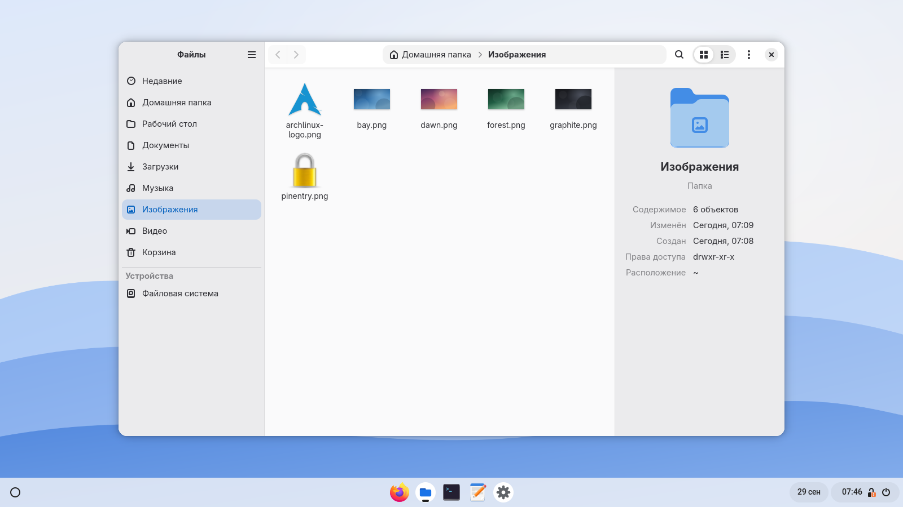
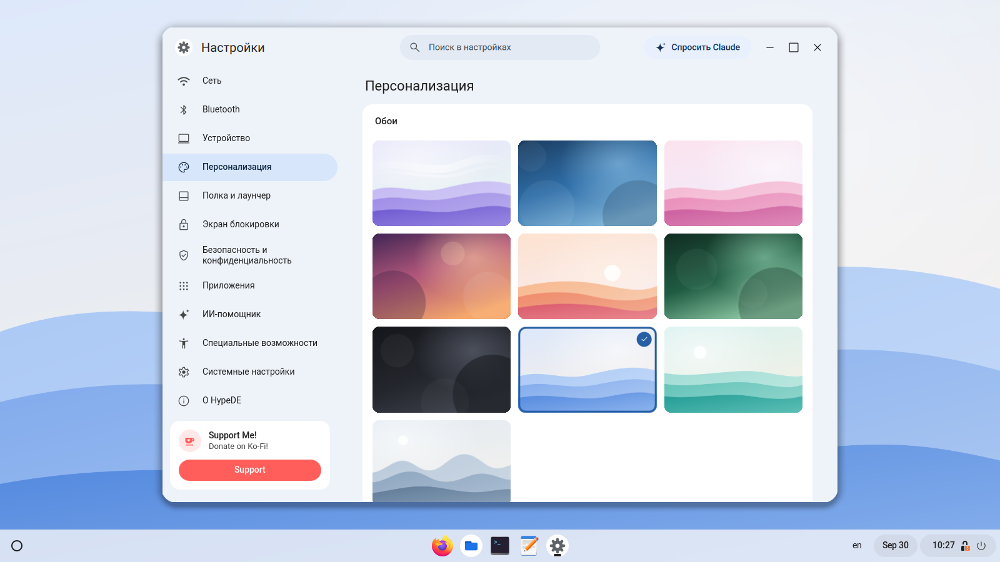
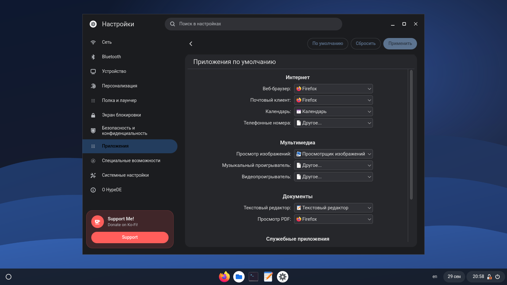
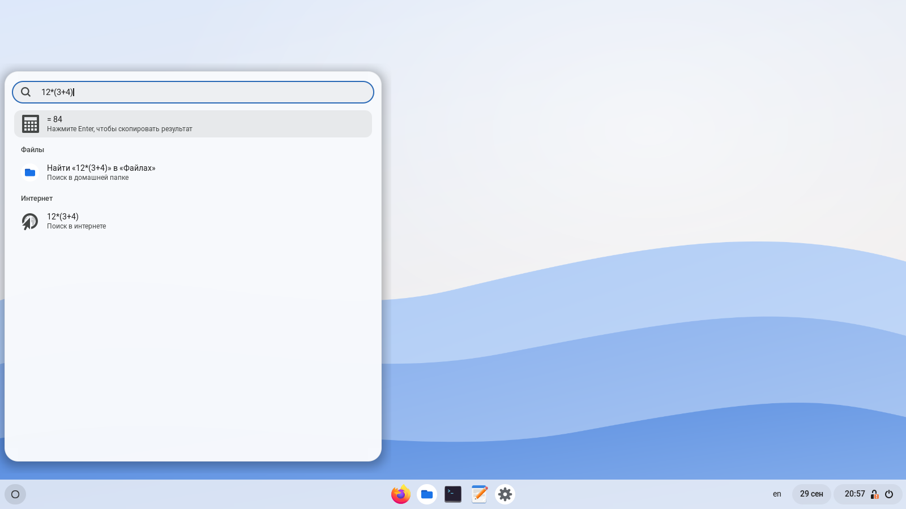
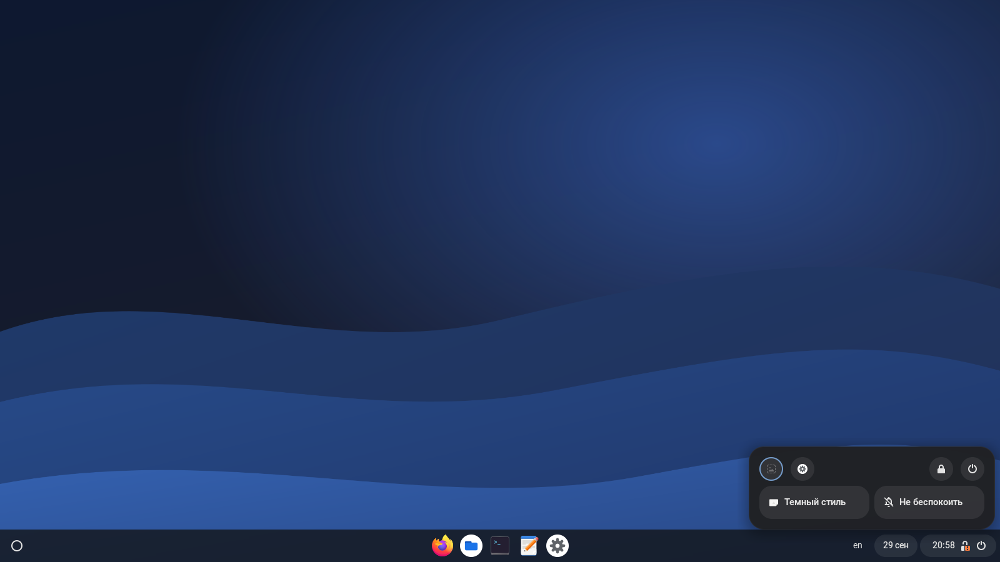
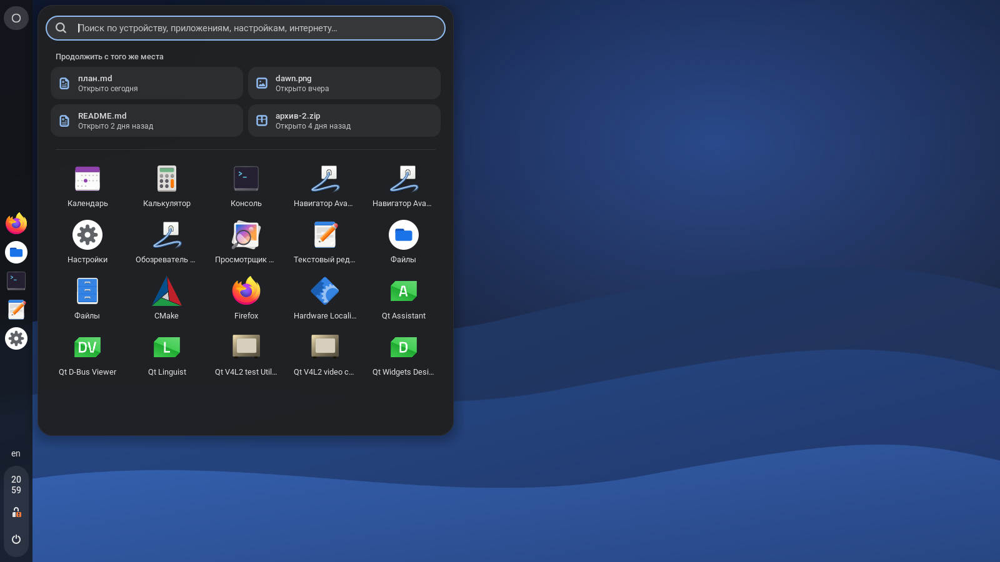
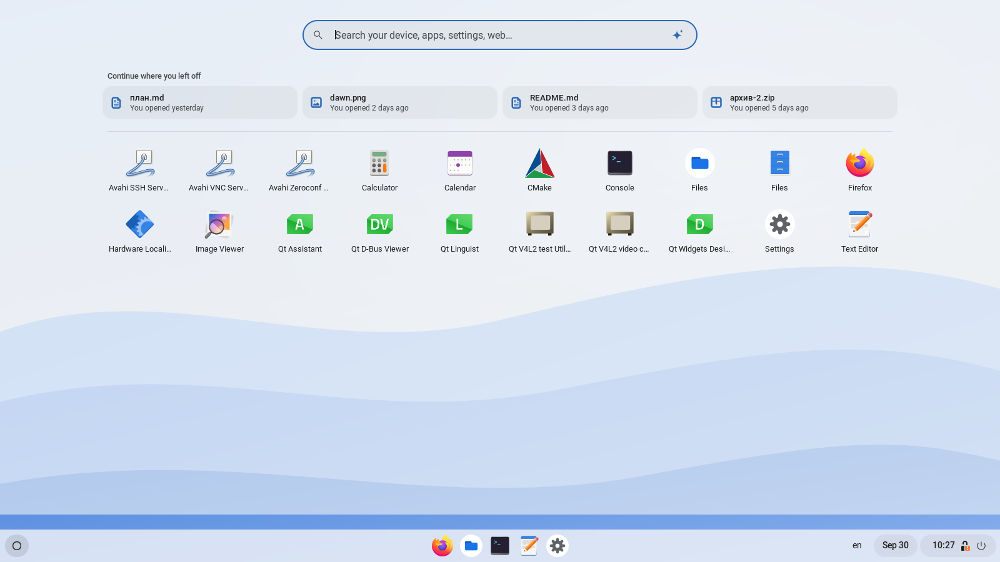
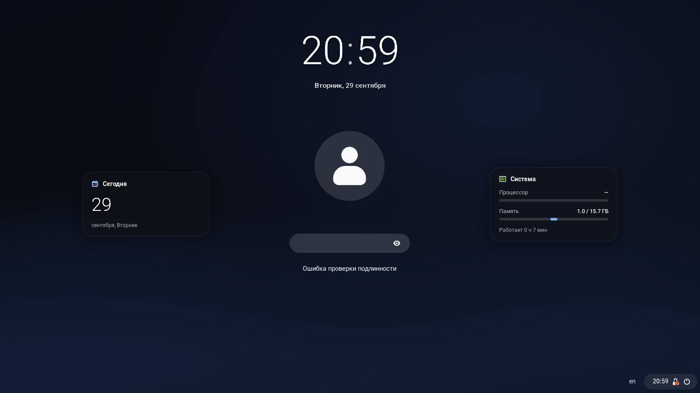
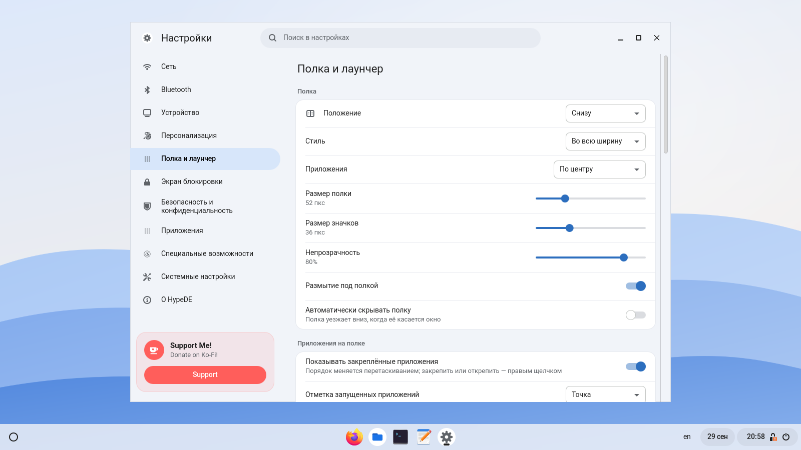

<p align="center">
  
</p>

<p align="center">
  <b>GNOME, reshaped into a Chrome OS–style desktop.</b><br>
  A shelf at the bottom, a bubble launcher and a status tray — on an unmodified GNOME Shell.<br>
  Settings built from KDE modules in a Chrome OS interface. A file manager mixing GNOME Files and COSMIC Files.
</p>

<p align="center">
  <a href="https://hypede.github.io">Website</a> ·
  <a href="#install-on-arch-linux-and-cachyos">Install</a> ·
  <a href="README.ru.md">Русский</a>
</p>

<p align="center">
  
</p>

---

## What it is

HypeDE is a separate session on top of a **stock** GNOME: no GNOME package is
patched or replaced. Your login screen gets a new “HypeDE” entry, and the
regular GNOME session on the same machine stays exactly as it was.

| Part | Built with | What it does |
|---|---|---|
| **Shell** | GNOME Shell 48–50 + a custom session mode and HypeDE's shell components | a shelf at any screen edge (bottom, left, right, top; full width or floating), launcher ring, pinned and running apps you can drag to reorder, “date + status + clock” tray, quick settings and calendar opening away from the edge, notifications in a corner of your choice, autohide, soft window animations, windows minimizing into their shelf icon, Super opens the launcher |
| **Launcher** | part of the shell | bubble or full-screen; search across apps, settings pages and recent files, a calculator (`12*(3+4)` → 84), web search, “Continue where you left off”, a grid of all apps with configurable columns, icon size, order and hidden apps |
| **Lock screen** | part of the shell, on top of GNOME's unlock dialog | colour waves when locking, blurred wallpaper, a big digital, stacked or analog clock, a password field that pops up, battery and system cards, a folding unlock animation |
| **Settings** | Qt 6 / QML + **KDE settings modules (KCM)** via KCMUtils | the Chrome OS Settings layout; network, Bluetooth, sound, printers, users, default apps, autostart and Flatpak permissions are real KDE modules embedded in the page; displays (resolution, refresh rate, scale, rotation), mouse, keyboard, fonts, icons, cursor, windows, animations, shelf, launcher, lock screen, storage, GNOME services, startup apps and backups of the whole configuration are HypeDE's own pages |
| **Files** | Python + GTK 4 + libadwaita | the GNOME Files layout (sidebar, path bar, search, selection bar) plus tabs and a details pane inspired by COSMIC Files; grid with thumbnails and list view, rubber-band selection, drag and drop, background copy/move with progress and undo, trash with restore |

All wallpapers, icons and texts are **original**. The look follows the layout
and behaviour of Chrome OS, but nothing is taken from Google: its assets and
fonts are proprietary. HypeDE is not affiliated with Google.

## Screenshots

<p align="center">
  
  
  
  
  
  
  
  
  
</p>

The screenshots were taken in a real GNOME Shell 50.5 session with KDE
Frameworks 6.30 on Arch Linux using `tools/dev/screenshots.sh` (the interface
language in them is Russian; English is the default).

## Install on Arch Linux and CachyOS

```bash
git clone https://github.com/hypede/hypede
cd hypede/packaging
makepkg -si
```

Log out and pick the **HypeDE** session on the login screen.

The KDE modules are optional. Without one, its row in Settings tells you which
package to install:

```bash
sudo pacman -S plasma-nm bluedevil plasma-pa print-manager plasma-workspace \
               plasma-desktop kde-cli-tools flatpak-kcm kinfocenter power-profiles-daemon
```

The build limits parallel compile jobs to your free memory, so it works on
machines with little RAM; force a value with `JOBS=2 makepkg -si`.

### Other distributions

Build dependencies: `cmake`, `extra-cmake-modules`, Qt 6 (base, declarative,
tools), KDE Frameworks 6 (`kcmutils`, `kcolorscheme`, `kconfig`, `kcoreaddons`)
and `gettext`. Runtime: GNOME Shell 48–50, `gnome-session`, PyGObject,
GTK 4, libadwaita ≥ 1.7, GVfs, Kirigami, `qqc2-desktop-style`, Roboto.

```bash
make
sudo make install
sudo glib-compile-schemas /usr/share/glib-2.0/schemas
```

### Just the shelf, inside regular GNOME

```bash
make install-user
# log out and back in, then:
gnome-extensions enable hypede-shell@hypede.dev
```

## Keyboard shortcuts

| Shortcut | Action |
|---|---|
| `Super` | launcher (can be switched to the overview in Settings) |
| `Super+S` | window and workspace overview |
| `Super+1…9` | pinned app by position |
| `Super+Space` | next keyboard layout |
| In Files | `Ctrl+T` new tab, `Ctrl+L` location, `Ctrl+F` search, `Ctrl+I` details, `F2` rename, `Ctrl+1/2` grid/list, `F1` shortcuts |

## How it works

```
shell/modes/hypede.json        GNOME Shell mode: top bar → shelf, enabled extensions
shell/extension/…              the extension: shelf, launcher, overview, notifications
shell/theme/stylesheet.css.in  shell theme (light and dark generated from one template)
session/                       login-screen session and gnome-session (systemd) units
data/                          settings schema, session defaults, .desktop files
apps/settings/                 Settings: C++/QML, KCMUtils, GSettings, D-Bus
apps/files/                    Files: Python, GTK 4, libadwaita
po/, tools/i18n/               translations
```

* **The shelf holds GNOME's own panel boxes.** HypeDE moves them into its
  shelf container, which lays them out along any screen edge. Struts,
  fullscreen hiding, keyboard navigation and every system indicator (network,
  sound, Bluetooth, power, screen recording) keep working.
* **Its own configuration.** The login screen starts `hypede-session`, which
  sets `DCONF_PROFILE=hypede`: every GSettings value — wallpaper, theme,
  fonts, shelf, even the list of enabled GNOME extensions — lives in
  `~/.config/dconf/hypede`, apart from regular GNOME. Keyboard layouts,
  peripherals, accessibility and shortcuts are copied over on first login.
  Settings → System can back the whole configuration up, restore or reset it.
* **Only HypeDE's shell components run in HypeDE.** GNOME extensions enabled
  for regular GNOME are not loaded (Settings → System can allow them), and
  HypeDE's shell lives in its own data directory, so regular GNOME doesn't see
  it either.
* **Only the GNOME services it needs.** The session target pulls in the
  essential settings daemons; file indexing, GNOME Software, calendar
  reminders, remote desktop, smart cards and the like are optional, and
  autostart entries such as Baloo can be switched off for HypeDE only.
* **KDE modules are loaded with `KCModuleLoader`** — the same function
  `kcmshell6` uses — so both QML modules and older widget-based ones (like
  plasma-nm's Connections) are embedded. A KDE colour scheme matching the
  Chrome OS palette follows GNOME's light/dark setting.
* **Files** is built from GTK list models: `Gtk.DirectoryList` → hidden-file
  filter → “folders first” sorter → `Gtk.MultiSelection`, shared by a
  `Gtk.GridView` and a `Gtk.ColumnView`. File operations run in background
  threads through Gio, so `trash://`, `sftp://` and `smb://` work too.

More detail (in Russian) is in [docs/ru](docs/ru).

## Known limitations

* Only KDE modules that talk to standard services are used (NetworkManager,
  BlueZ, PipeWire, CUPS, AccountsService, `mimeapps.list`, XDG autostart,
  Flatpak). Modules that configure KWin, KScreen or PowerDevil would do nothing
  under GNOME, so those pages are implemented on GSettings instead.
* Resolution, refresh rate, scale and rotation are set in HypeDE Settings
  through Mutter; arranging several monitors side by side still opens GNOME
  Settings (`gnome-control-center display`).
* Pairing Bluetooth devices that need a PIN relies on the bluedevil agent.
* Supports GNOME 48–50; tested on 50.5.

## Development

```bash
make check                        # JS syntax, Files and calculator tests, schema, translations
tools/dev/shell-headless.sh start # GNOME Shell on a virtual monitor (containers, SSH)
tools/dev/screenshots.sh out/     # regenerate all documentation screenshots
```

See [docs/ru/building.md](docs/ru/building.md) for the headless workflow and
translation tooling.

## Support

If you like HypeDE, you can support its development on
[Ko-fi](https://ko-fi.com/pycodder).

## License

HypeDE is free software, released under the
[GNU General Public License v3.0 or later](LICENSE). The KDE colour schemes in
`apps/settings/colors/` are derived from Breeze.
